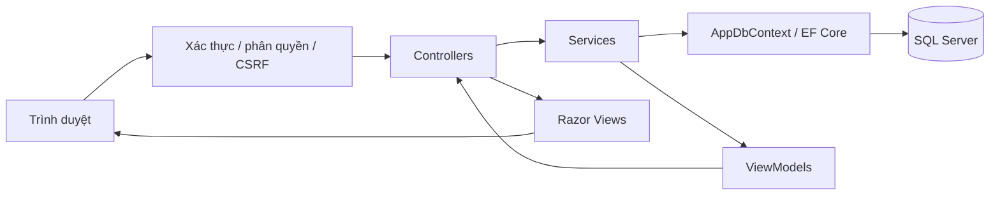

# Thiết kế backend — LanguageCenterManagement

Ngày 07/10/2026. Căn cứ: `Architechtured.md` và `database/001_CreateDatabase.sql`. Đây là đặc tả triển khai backend, chưa phải backend chạy được.

## 1. Kiến trúc và phạm vi

Một ứng dụng ASP.NET Core MVC render Razor Views, C#, EF Core SQL Server và database `QLTrungTamNgoaiNgu`. Đề xuất target .NET 10 theo SDK hiện có; các package EF Core chọn cùng phiên bản major và pin phiên bản patch khi triển khai. Không cần API riêng cho bản MVC ban đầu.



Controller nhận input, kiểm tra ModelState và trả View/redirect/status. Service quản lý quy tắc nghiệp vụ và transaction. DbContext ánh xạ bảng và quan hệ. Entity biểu diễn dữ liệu lưu trữ; ViewModel là hợp đồng đọc/ghi của từng màn hình. Chưa thêm Repository vì DbContext đã phục vụ truy vấn và lưu thay đổi.

## 2. Cấu trúc triển khai

```text
LanguageCenterManagement/
  Controllers/
    HomeController.cs
    HocSinhController.cs
    GiaoVienController.cs
    KhoaHocController.cs
    LopHocController.cs
    DangKyLopController.cs
    ThongKeController.cs
    TaiKhoanController.cs
  Models/
    HocSinh.cs
    GiaoVien.cs
    KhoaHoc.cs
    LopHoc.cs
    HocSinhLopHoc.cs
    TaiKhoan.cs
    ViewModels/
      DashboardViewModel.cs
      HocSinhFormViewModel.cs
      GiaoVienFormViewModel.cs
      KhoaHocFormViewModel.cs
      LopHocFormViewModel.cs
      LopHocChiTietViewModel.cs
      DangKyLopViewModel.cs
      ChuyenLopViewModel.cs
      LoginViewModel.cs
      ProfileViewModel.cs
      ThongKeViewModel.cs
      PagedResult.cs
  Data/
    AppDbContext.cs
    Configurations/                 # Fluent API cho sáu entity
    SeedData.cs
    Migrations/                     # Chỉ dùng sau khi chọn baseline
  Services/
    HocSinhService.cs
    GiaoVienService.cs
    KhoaHocService.cs
    LopHocService.cs
    DangKyLopService.cs
    ThongKeService.cs
    TaiKhoanService.cs
    ServiceResult.cs
  Security/
    Roles.cs
    CookieValidationEvents.cs
  Views/                            # Giữ các thư mục như kiến trúc gốc
  wwwroot/
  Properties/launchSettings.json
  Program.cs
  appsettings.json
  LanguageCenterManagement.csproj
```

`DangKyLopService` bổ sung để tập trung đăng ký/hủy/chuyển lớp ở một nơi. Các hành động ThemHocSinh/XoaHocSinh/ChuyenLop dự kiến trong LopHocService chuyển sang service này; controller lớp và controller đăng ký cùng gọi service đó. Dùng DI scoped cho DbContext và services. Tất cả truy vấn/lưu dùng async, nhận CancellationToken.

## 3. Ánh xạ database

DbSet: HocSinhs, GiaoViens, KhoaHocs, LopHocs, HocSinhLopHocs, TaiKhoans. Dùng ToTable với tên bảng số ít và schema dbo; không để EF tự tạo bảng theo tên DbSet.

| Entity | Khóa | Quan hệ/navigation |
| --- | --- | --- |
| HocSinh | MaHS, identity | ICollection<HocSinhLopHoc>, ICollection<TaiKhoan> |
| GiaoVien | MaGV, identity | ICollection<LopHoc>, ICollection<TaiKhoan> |
| KhoaHoc | MaKH, identity | ICollection<LopHoc> |
| LopHoc | MaLop, identity | KhoaHoc bắt buộc, GiaoVien nullable, ICollection<HocSinhLopHoc> |
| HocSinhLopHoc | khóa kép MaHS + MaLop | HocSinh và LopHoc bắt buộc |
| TaiKhoan | MaTK, identity | HocSinh/GiaoVien nullable; TenDangNhap unique |

Kiểu C#: DATE → DateOnly?; INT nullable → int?; DECIMAL → decimal?; BIT nullable → bool?; chuỗi nullable → string?. Giữ đúng NULL của SQL kể cả TrangThai tài khoản, không mặc định coi NULL là đang hoạt động. Fluent API khai báo MaxLength, Unicode/IsUnicode(false), column type date, HocPhi precision (18,2), default GETDATE() và default 1. Mọi FK dùng DeleteBehavior.NoAction, không cascade.

Tên/Họ tên bắt buộc trong SQL vẫn phải kiểm tra chuỗi trắng ở ứng dụng. Form có thể yêu cầu thêm trường phục vụ nghiệp vụ, nhưng entity tiếp tục đọc được dữ liệu cũ thiếu trường.

## 4. Hợp đồng controller

Route MVC: `/{controller}/{action=Index}/{id?}`; `/` mở Home/Index. Mọi POST dùng antiforgery; GET không thay đổi dữ liệu. Sau POST thành công dùng Post/Redirect/Get và TempData thông báo.

| Controller | GET | POST | Service |
| --- | --- | --- | --- |
| Home | Index, Error | — | ThongKeService |
| HocSinh | Index, Search, Details(id), Create, Edit(id), Delete(id) | Create, Edit(id), Delete(id) | HocSinhService |
| GiaoVien | Index, Search, Details(id), Create, Edit(id), Delete(id) | Create, Edit(id), Delete(id) | GiaoVienService |
| KhoaHoc | Index, Details(id), Create, Edit(id), Delete(id) | Create, Edit(id), Delete(id) | KhoaHocService |
| LopHoc | Index, Details(id), Create, Edit(id), Delete(id), DanhSachHocSinh(id), PhanCongGiaoVien(id) | Create, Edit(id), Delete(id), PhanCongGiaoVien(id) | LopHocService |
| DangKyLop | Index, Create, ChuyenLop(maHS, maLop), Delete(maHS, maLop) | Create, ChuyenLop, Delete | DangKyLopService |
| ThongKe | Index, HocSinhTheoLop, HocSinhTheoKhoaHoc, LopTheoGiaoVien | — | ThongKeService |
| TaiKhoan | Login, Profile | Login, Logout, DoiMatKhau | TaiKhoanService |

Search dùng chung truy vấn Index, tránh hai bộ lọc khác nhau. Bảng đăng ký có khóa kép nên không sử dụng một `id` giả. Delete của đăng ký là hủy trạng thái, không xóa dòng. Delete hồ sơ không có quan hệ được xóa thật sau màn hình xác nhận; có quan hệ thì từ chối xóa và hướng dẫn ngừng hoạt động nếu entity hỗ trợ trạng thái. KhoaHoc không có TrangThai nên chỉ từ chối xóa khi có lớp, không giả định có chức năng lưu trữ khóa học.

## 5. ViewModels và kết quả service

- List query: q, trangThai, page mặc định 1, pageSize mặc định 20, tối đa 100; lớp thêm maKH/maGV. Sắp xếp theo allowlist và thêm khóa chính để phân trang ổn định.
- Form học viên/giáo viên: các trường hồ sơ theo schema, loại bỏ navigation và tài khoản. NgayDangKy học viên do server đặt khi tạo, không tin giá trị từ form.
- Form khóa học: TenKH, MoTa, HocPhi, ThoiLuong, TrinhDo. Tạm quy ước ThoiLuong theo giờ; ghi rõ nhãn, xác nhận đơn vị trước nhập dữ liệu thực.
- Form lớp: TenLop, MaKH, MaGV nullable, ngày bắt đầu/kết thúc, LichHoc, PhongHoc, SiSoToiDa, TrangThai. Dropdown khóa học/giáo viên là dữ liệu hiển thị được tải lại khi form lỗi.
- DangKyLopViewModel: MaHS, MaLop và danh sách chọn; ngày và trạng thái do server đặt.
- ChuyenLopViewModel: MaHS, MaLopNguon, MaLopDich; không cho phép client gửi sĩ số hay trạng thái nguồn.
- DashboardViewModel: bốn tổng số như kiến trúc gốc và danh sách lớp còn chỗ. Các tổng số là số bản ghi; nếu thêm chỉ số hoạt động phải ghi nhãn riêng.
- ProfileViewModel chỉ chứa tên đăng nhập, vai trò và thông tin hồ sơ được phép xem; không bao giờ đưa MatKhau ra view hoặc JSON.

`ServiceResult<T>` gồm thành công, dữ liệu, mã lỗi và lỗi theo trường. Mã: NotFound, Validation, Conflict, CapacityExceeded, AlreadyRegistered, Inactive, HasDependencies. Controller trả 404 khi thiếu bản ghi; lỗi nghiệp vụ đưa vào ModelState với thông báo tiếng Việt. Lỗi database chưa dự kiến được log nội bộ và trả trang lỗi chung, không lộ connection string/stack trace.

Không bind entity trực tiếp từ POST. Nạp entity theo khóa rồi gán allowlist trường được phép sửa để tránh overposting. Id route và id form phải khớp nếu form chứa id.

## 6. Quy tắc nghiệp vụ

Trạng thái đề xuất lưu dưới dạng chuỗi mã trong NVARCHAR, nhãn tiếng Việt ở view: hồ sơ Active/Inactive; lớp Draft/Open/InProgress/Completed/Cancelled; đăng ký Active/Cancelled/Transferred. Vai trò VARCHAR: Admin/Staff. Các mã là quyết định thiết kế mới; khi có dữ liệu cũ cần đối chiếu và chuyển đổi rõ ràng. Giá trị NULL/không nhận diện không đủ điều kiện đăng ký.

HocSinhService/GiaoVienService: tên trim không rỗng, độ dài theo SQL; ngày sinh không ở tương lai; kiểm tra email nếu nhập; yêu cầu ít nhất điện thoại hoặc email khi tạo; cảnh báo trùng liên hệ thay vì coi là khóa unique. Ngừng hoạt động học viên đang có đăng ký hiệu lực phải yêu cầu hủy/chuyển trước. Giáo viên đang phụ trách lớp Open/InProgress phải được thay thế trước khi ngừng hoạt động.

KhoaHocService: học phí >= 0 nếu có; thời lượng > 0 nếu có; tên bắt buộc. Không xóa khóa học có lớp.

LopHocService: khóa học phải tồn tại; giáo viên nếu chọn phải Active; ngày kết thúc >= bắt đầu; sĩ số dương. Draft cho phép thiếu lịch/ngày/sĩ số; chuyển Open yêu cầu lịch, ngày, phòng, sĩ số hợp lệ. Chuyển InProgress yêu cầu giáo viên. Không giảm sĩ số dưới số đăng ký Active. Lớp chỉ đăng ký khi Open và chưa qua ngày kết thúc; Completed/Cancelled là trạng thái kết thúc, không tự mở lại trong MVP. Không được hủy lớp còn đăng ký Active; xử lý các đăng ký trước.

Lịch chuỗi chỉ dùng hiển thị; chưa cam kết kiểm tra trùng giáo viên/phòng/học viên. Mọi kiểm tra điều kiện có thể thay đổi đồng thời phải thực hiện trong transaction ghi tương ứng, không chỉ trong GET form.

## 7. Đăng ký, hủy và chuyển lớp đồng thời

Khóa kép SQL chống hai dòng cùng cặp, nhưng không bảo vệ sức chứa. Đề xuất transaction ngắn và khóa các dòng liên quan bằng truy vấn tham số hóa `UPDLOCK, HOLDLOCK` trên SQL Server. Đây là thiết kế của dự án cần kiểm thử tích hợp, không phải chỉ thêm BeginTransaction là đủ.

Quy ước mọi thao tác đăng ký/hủy/chuyển đều khóa học viên trước, sau đó khóa các lớp theo MaLop tăng dần. Các service thay đổi trạng thái học viên, trạng thái/sĩ số lớp hoặc xóa các bản ghi đó cũng phải tuân theo giao thức tương ứng. Không giữ transaction trong lúc người dùng xác nhận form.

Đăng ký:

1. Bắt đầu transaction; khóa/nạp học viên và lớp.
2. Kiểm tra học viên Active, lớp Open, ngày và sĩ số hợp lệ.
3. Tìm cặp MaHS–MaLop. Nếu Active trả AlreadyRegistered; không tăng sĩ số.
4. Đếm đăng ký Active tại lớp khi đã giữ khóa lớp; nếu đạt giới hạn trả CapacityExceeded.
5. Tạo dòng mới hoặc kích hoạt dòng đã hủy/chuyển; đặt ngày theo thời gian trung tâm.
6. SaveChanges và commit; lỗi thì rollback.

Hủy: khóa cùng thứ tự, kiểm tra cặp tồn tại và đổi Active → Cancelled. Hủy lại dòng đã Cancelled trả thành công không tạo thêm thay đổi; dòng Transferred báo không còn đăng ký hiệu lực tại lớp nguồn.

Chuyển:

1. Từ chối nguồn = đích. Bắt đầu transaction, khóa học viên rồi cả hai lớp theo thứ tự.
2. Đọc lại nguồn và yêu cầu đăng ký Active; kiểm tra học viên và lớp đích như đăng ký mới.
3. Đích đã Active thì báo trùng; đích đầy thì giữ nguyên nguồn.
4. Đổi nguồn thành Transferred, tạo/kích hoạt đích Active; SaveChanges một lần và commit.

Nếu deadlock hoặc transient failure: rollback và retry có giới hạn toàn bộ transaction khi lỗi được nhận diện là có thể thử lại, dùng DbContext mới cho mỗi lần; không retry từng lệnh. Khi EnableRetryOnFailure được bật, bao toàn bộ transaction trong execution strategy. Khi không xác định được commit đã thành công, đối chiếu trạng thái các khóa trước khi báo kết quả; không tự nhân đôi thao tác. Không trả thành công cho mọi lỗi SQL. Khóa kép và cập nhật trạng thái giúp thao tác không tạo thêm dòng trùng, nhưng schema chưa có idempotency key hoặc nhật ký đầy đủ.

## 8. Xác thực và phân quyền

Dùng bảng TaiKhoan hiện hữu và cookie authentication, PasswordHasher<TaiKhoan> để hash/verify. Không cần tạo bảng Identity mới cho phương án này.

| Chức năng | Admin | Staff | Chưa đăng nhập |
| --- | --- | --- | --- |
| Tổng quan, CRUD hồ sơ/khóa/lớp, đăng ký, thống kê | Có | Có | Không |
| Xóa thật hồ sơ/khóa/lớp | Có | Không | Không |
| Hồ sơ tài khoản, đổi mật khẩu của mình | Có | Có | Không |
| Đăng nhập | Có | Có | Có |

Vai trò học viên/giáo viên chưa có màn hình trong MVP; mặc định từ chối truy cập nội bộ. Quản lý tài khoản người khác là phần mở rộng, không âm thầm mở đăng ký tài khoản công khai.

Login kiểm tra tài khoản TrangThai == true và vai trò allowlist, trả thông báo chung nếu sai. Tạo claims MaTK/Name/Role; cookie HttpOnly, Secure trên HTTPS, SameSite=Lax, thời hạn đề xuất 8 giờ. Rate limit login; không log mật khẩu. Chỉ LocalRedirect với returnUrl hợp lệ. Logout dùng POST và xóa cookie.

CookieValidationEvents đọc lại tài khoản để thu hồi phiên khi khóa tài khoản/đổi vai trò. Đổi mật khẩu: yêu cầu mật khẩu cũ; cập nhật hash; so hash hiện tại trong quá trình validation phiên qua dấu fingerprint bảo vệ trong ticket để thu hồi các cookie cũ, không đưa hash thô vào claims. Không dùng cookie role cũ như nguồn quyền duy nhất. Persist Data Protection keys trong môi trường triển khai.

Tạo Admin ban đầu qua tác vụ seed chủ động với mật khẩu từ secret; chỉ khi chưa có tài khoản, không ghi mật khẩu mặc định vào repo. Không chạy seed quản trị hay migration tự động mỗi lần khởi động production.

## 9. Truy vấn, cấu hình và vận hành

Danh sách dùng AsNoTracking, projection sang ViewModel, lọc và phân trang ở database; tránh tải toàn bộ bảng hay truy vấn từng dòng. Dashboard tổng số và báo cáo có thể chạy tuần tự trên cùng DbContext; không dùng Task.WhenAll cho các query cùng context. Thống kê học viên theo khóa học đếm distinct MaHS trong các đăng ký Active, tránh đếm một học viên nhiều lần trong cùng khóa; báo cáo theo lớp đếm đăng ký Active. Báo cáo lớp theo giáo viên có nhóm chưa phân công.

Connection string tên DefaultConnection trỏ QLTrungTamNgoaiNgu; credentials đặt trong User Secrets ở development, biến môi trường/secret store khi triển khai. Không commit mật khẩu hoặc production connection string. Dùng tài khoản SQL có quyền phù hợp; không dùng quyền tạo database cho ứng dụng thường ngày.

Program đăng ký MVC, DbContext UseSqlServer, services, PasswordHasher, cookie auth, authorization và rate limiter. Thứ tự middleware dự kiến: exception handler/HSTS ở production → HTTPS → static files → routing → authentication → authorization → rate limiter cho endpoint login → routes. Global AutoValidateAntiforgeryToken cho MVC; Anonymous chỉ Login và trang lỗi cần thiết. Trang lỗi không trả thông tin nhạy cảm.

Ngày nghiệp vụ lấy theo múi giờ Asia/Ho_Chi_Minh bằng abstraction clock/TimeProvider, không phụ thuộc timezone server. Log lỗi có correlation ID và mã bản ghi cần thiết, hạn chế thông tin liên hệ. Schema hiện chỉ lưu DATE cho ngày đăng ký; không tuyên bố có thời điểm/audit chi tiết.

## 10. Khởi tạo database và kiểm chứng

Giai đoạn đầu dùng SQL script người dùng làm nguồn schema. Nếu database chưa tồn tại, chạy script chủ động; nếu đã tồn tại, kiểm tra schema trước. Không chạy EnsureCreated hoặc initial migration tạo trùng bảng trên database có sẵn. Khi chuyển sang EF migrations cần baseline khớp schema đã kiểm tra, review SQL trước khi áp dụng; không chỉ đánh dấu migration đã chạy khi chưa đối chiếu.

Seed khóa học theo danh sách kiến trúc gốc phải chống thêm trùng khi chạy lại. Seed dữ liệu mẫu chỉ ở development và qua thao tác chủ động.

Kiểm thử cần thiết khi triển khai:

- Build, ánh xạ sáu bảng trên SQL Server thật; kiểm tra NULL, khóa kép, precision và không cascade.
- CRUD validation, lỗi bản ghi không tồn tại, xóa có quan hệ và input overposting.
- Login đúng/sai/khóa, thu hồi cookie, Staff không xóa thật, Anonymous không truy cập; POST thiếu CSRF bị từ chối.
- Hai yêu cầu tranh chỗ cuối: đúng một thành công; hai đăng ký cùng cặp không tạo trùng.
- Chuyển tới lớp đầy/đăng ký trùng/lỗi lưu: nguồn giữ nguyên; chuyển thành công: nguồn Transferred, đích Active.
- Đăng ký lại sau hủy, hủy lặp, hai chuyển đồng thời; giảm sức chứa đồng thời với đăng ký không vượt giới hạn.
- Thống kê distinct theo khóa và phân trang đúng.

Không dùng EF InMemory làm bằng chứng cho khóa, transaction hoặc SQL Server concurrency. Tài liệu này đã đối chiếu với kiến trúc và schema; các kiểm thử chạy backend chỉ thực hiện được sau khi có mã nguồn và SQL Server.

## 11. Thứ tự triển khai theo kiến trúc gốc

1. Database → Models → AppDbContext → cấu hình SQL Server.
2. Xác thực và phân quyền nền tảng để các module sau dùng chung.
3. CRUD Học sinh → Giáo viên → Khóa học → Lớp học.
4. Đăng ký/hủy/chuyển lớp → phân công giáo viên.
5. Dashboard → tìm kiếm hoàn thiện → thống kê → ghép giao diện prototype vào Razor Views.

## Tài liệu kỹ thuật tham chiếu

- [Microsoft: cookie authentication không dùng Identity](https://learn.microsoft.com/en-us/aspnet/core/security/authentication/cookie?view=aspnetcore-10.0).
- [Microsoft: transactions trong EF Core](https://learn.microsoft.com/en-us/ef/core/saving/transactions).
- [Microsoft: SQL Server locking và row versioning](https://learn.microsoft.com/en-us/sql/relational-databases/sql-server-transaction-locking-and-row-versioning-guide?view=sql-server-ver17).
