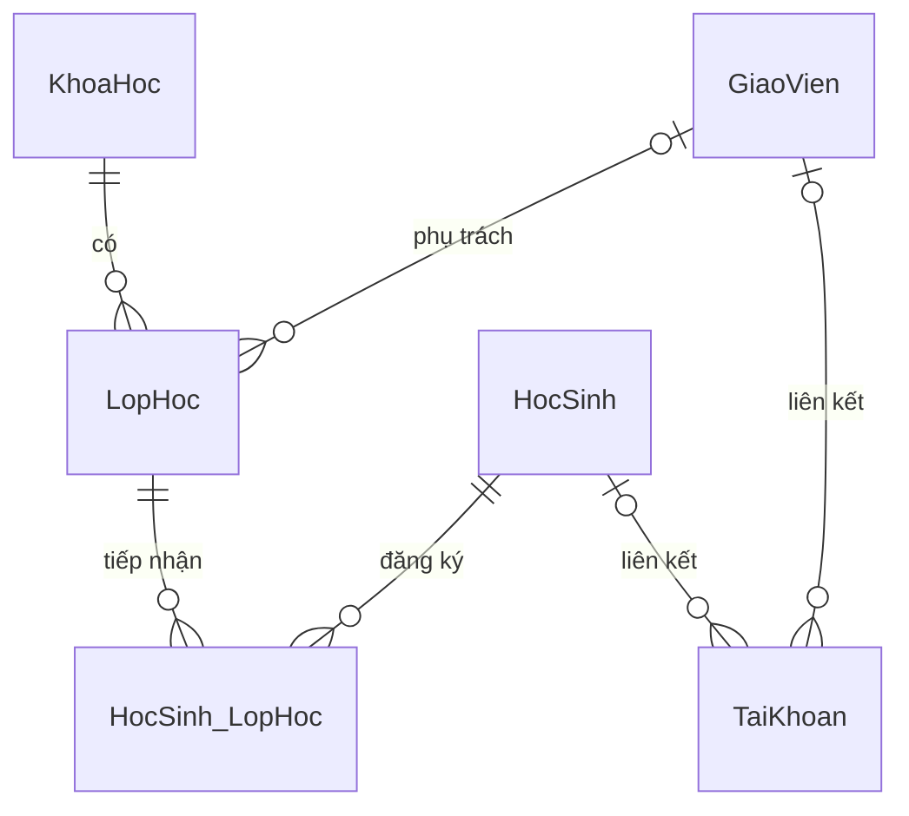

# Mô hình dữ liệu theo schema được cung cấp

Schema gốc được lưu tại `database/001_CreateDatabase.sql`. Giữ nguyên các cột, kiểu dữ liệu, khả năng NULL và khóa của thiết kế người dùng; thêm tiền tố `dbo`, dấu kết thúc câu lệnh và chú thích. Chưa chạy script trên SQL Server.

Một lớp bắt buộc thuộc một khóa học. `MaGV` nullable nên lớp có thể chưa được phân công giáo viên; sau khi phân công, mỗi lớp có một giáo viên. Học viên và lớp có quan hệ nhiều–nhiều qua `HocSinh_LopHoc`.

## Ánh xạ sang ASP.NET Core MVC

| Entity C# | Bảng SQL | Khóa | Lưu ý |
| --- | --- | --- | --- |
| HocSinh | HocSinh | MaHS | Hồ sơ học viên |
| GiaoVien | GiaoVien | MaGV | Hồ sơ giáo viên |
| KhoaHoc | KhoaHoc | MaKH | HocPhi có precision (18,2) |
| LopHoc | LopHoc | MaLop | MaKH bắt buộc, MaGV là int? |
| HocSinhLopHoc | HocSinh_LopHoc | (MaHS, MaLop) | Cấu hình khóa kép và tên bảng trong DbContext |
| TaiKhoan | TaiKhoan | MaTK | TenDangNhap unique; MatKhau lưu hash |

Các cột SQL cho phép NULL phải ánh xạ sang kiểu nullable tương ứng. Ngày dùng kiểu ngày không chứa giờ. `NgayDangKy` có default nhưng vẫn cho phép NULL khi gửi NULL tường minh. Không bật cascade delete; thao tác xóa hồ sơ có quan hệ cần được xử lý bằng thông báo nghiệp vụ hoặc ngừng hoạt động.

## Hành vi sản phẩm trên schema này

- Sĩ số lấy từ số đăng ký có trạng thái hiệu lực; không đếm đăng ký đã hủy/chuyển.
- Khóa kép chỉ cho một dòng trên mỗi cặp học viên–lớp, kể cả khi đã hủy. Đăng ký lại phải kích hoạt dòng hiện có; schema chưa lưu được lịch sử các lần đăng ký riêng biệt.
- Chuyển lớp cập nhật trạng thái dòng nguồn và tạo/kích hoạt dòng đích trong cùng transaction. Kiểm tra lớp đích còn chỗ, đang tuyển và khác lớp nguồn; rollback nếu có lỗi. Schema chưa có bảng nhật ký chuyển lớp.
- `LichHoc` là chuỗi mô tả. MVP hiển thị lịch; muốn kiểm tra trùng lịch chính xác cần bảng lịch có ngày/thứ và giờ riêng.
- `TaiKhoan` cho phép cả hai liên kết NULL, phù hợp tài khoản quản trị/nhân viên. Schema hiện cũng cho phép cả hai có giá trị và nhiều tài khoản cùng liên kết một hồ sơ; giới hạn nghiệp vụ này cần xác định trước khi bổ sung CHECK/UNIQUE.
- Dùng PasswordHasher hoặc thư viện xác thực tương đương với bảng TaiKhoan; không tự viết thuật toán hash. ASP.NET Core Identity đầy đủ cần thêm mô hình/bảng Identity, không tự động tương thích với bảng hiện tại.

## Đề xuất bổ sung sau schema gốc

Chưa áp dụng các thay đổi này vào SQL: CHECK cho học phí không âm, thời lượng/sĩ số dương, thứ tự ngày; quy ước trạng thái/vai trò; index khóa ngoại; nhật ký thao tác; lịch học có cấu trúc. Quy tắc chống vượt sĩ số phải được bảo vệ ở server bằng transaction và cơ chế khóa/đồng thời, không chỉ kiểm tra trên giao diện.

Đơn vị `ThoiLuong` chưa được chỉ rõ (giờ, buổi hay tuần); cần thống nhất trước khi tạo form thật.

## Sử dụng script

Mở script trong SSMS, kết nối SQL Server dành cho phát triển và chạy khi database `QLTrungTamNgoaiNgu` chưa tồn tại. Script tạo mới, không phải migration cho database hiện hữu và không thiết kế để chạy lặp. `GO` là dấu phân cách batch của công cụ chạy script; không gửi nguyên file như một lệnh SQL qua DbContext.
